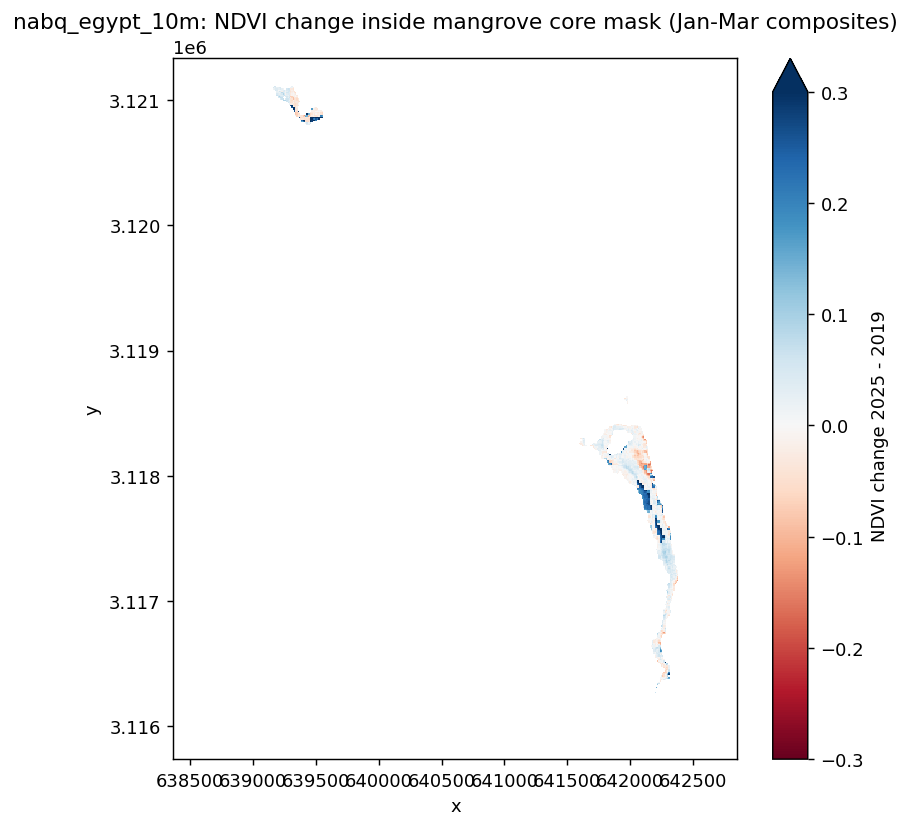
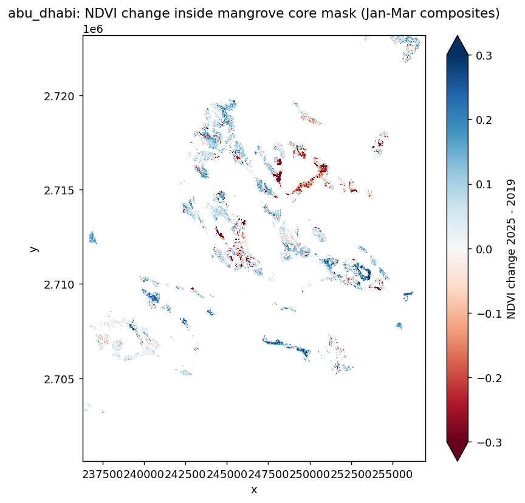

# Blue Carbon & Mangrove Health Monitoring
### Arab Youth Space Hackathon 2026 · 813 Challenge

**Team Leader:** Reham Abdulraouf  
**Country:** Egypt  
**Theme:** Ecosystem Health, Biodiversity & Blue Carbon  
**Repository:** https://github.com/starlettremaa/blue-carbon-monitoring

---

## 1. Title & Summary

A satellite-based screening tool that monitors mangrove health and estimates blue carbon stocks along the Egyptian Red Sea coast, using Sentinel-2 multispectral imagery and calibrated change detection to identify areas of concern before visible degradation occurs.

---

## 2. Business Use Case

**Who uses this:** Environmental protection agencies (Egyptian Environmental Affairs Agency — EEAA), national park rangers, and blue carbon project managers.

**What decision they make:** Which mangrove patches to inspect first, where to prioritize protection, and whether a site qualifies for blue carbon credit programs.

**What they use today:** Expensive, infrequent field surveys that are logistically difficult in remote coastal zones — with no continuous temporal coverage.

**Why satellite data:** Sentinel-2 provides free, cloud-screened imagery every 5 days at 10m resolution, enabling routine monitoring at a fraction of field survey cost.

---

## 3. Problem Statement

Egypt's Red Sea mangroves — including Nabq and Wadi El Gemal — hold an estimated **1,670 to 2,619 tonnes of carbon** in just 38.8 hectares. Despite their value, no routine spectral monitoring system exists for these sites. Degradation occurs silently: by the time it is visible on the ground, carbon has already been released.

The global mangrove loss rate is 0.3–0.6% per year. For small, isolated stands like Nabq, even minor stress events can represent significant carbon exposure. Early detection from space enables timely intervention.

---

## 4. Data Used

| Dataset | Provider | Dates | Resolution | Licence |
|---|---|---|---|---|
| Sentinel-2 L2A | ESA Copernicus / Microsoft Planetary Computer | Jan–Mar 2019 & Jan–Mar 2025 | 10m / 20m | Open (CC-BY) |
| ESA WorldCover 2021 | ESA / Planetary Computer | 2021 | 10m | Open (CC-BY) |
| Global Mangrove Watch v4 | JAXA / Zenodo | 1996–2024 | Vector | Open |

**Bands used:** B04 (Red), B05 (Red-Edge), B08 (NIR)  
**Indices computed:** NDVI, NDRE  
**Cloud filtering:** < 20% cloud cover per scene; median composite of 15 scenes per period  
**Carbon density source:** Almahasheer et al. (2017), Red Sea soil (43 t C/ha, first metre); Qatar tree + soil literature for upper range

---

## 5. Technical Approach

The pipeline follows five steps:

**Step 1 — Discover:** Query Planetary Computer STAC for Sentinel-2 L2A scenes covering the AOI, filtered by date range and cloud cover.

**Step 2 — Load:** Stream B04, B05, B08 bands via stackstac into an xarray DataArray at native resolution, applying the Sentinel-2 offset correction (subtract 1000 when processing_baseline ≥ 04.00).

**Step 3 — Inspect:** Print B08 quantiles for both years to confirm radiometric consistency before computing indices.

**Step 4 — Analyse:**
- Compute NDVI = (B08 − B04) / (B08 + B04) and NDRE = (B08 − B05) / (B08 + B05)
- Build seasonal median composites (Jan–Mar) for 2019 (baseline) and 2025 (recent)
- Apply ESA WorldCover class 95 (mangrove) mask, then erode by one pixel to create a core mask that removes edge effects
- Use Nabq as a reference site to derive the decline threshold from observed natural variability (MAD-sigma method) rather than arbitrary cutoffs
- Compute per-pixel NDVI change and classify pixels as declined / stable / improved

**Step 5 — Communicate:** Export change maps as GeoTIFF and PNG; compute carbon stock range from area × literature density values; summarise in CSV.

---

## 6. Installation

Requires Python 3.11+.

```bash
git clone https://github.com/starlettremaa/blue-carbon-monitoring.git
cd blue-carbon-monitoring
python -m venv .venv
source .venv/bin/activate        # Windows: .venv\Scripts\activate
pip install -r requirements.txt
```

---

## 7. How to Run

```bash
jupyter lab notebooks/02_main_analysis.ipynb
```

1. Open the notebook and run **Runtime → Run all** (or Kernel → Restart & Run All).
2. No credentials required — data is accessed via the public Planetary Computer STAC endpoint.
3. Expected runtime: ~8–12 minutes depending on network speed.
4. Outputs are written to `results/`.

**What you will see at the end:**
- Two NDVI change maps (Nabq, Egypt and Abu Dhabi, UAE) saved as PNG
- `summary.csv` — per-site NDVI statistics
- `carbon_range.csv` — carbon stock estimates by density scenario
- `calibrated_threshold.csv` — percentage of pixels exceeding the decline threshold

---

## 8. Example Input & Output

**Input:** Sentinel-2 L2A scenes retrieved automatically via STAC.  
A documented retrieval script with exact parameters is in `data/sample_input/`.

**Output:**

**Nabq, Egypt — NDVI Change 2019 → 2025**  


*Blue = vegetation improvement. Red = vegetation decline. White = stable.*

**Abu Dhabi, UAE — NDVI Change 2019 → 2025**  


---

## 9. Results & Limitations

### Results

| Site | Area (ha) | Carbon stock (t C) | NDVI 2019 | NDVI 2025 | Pixels below threshold |
|---|---|---|---|---|---|
| Nabq, Egypt | 38.8 | 1,670 – 2,619 | 0.579 | 0.585 | 1.4% |
| Abu Dhabi, UAE | 3,332 | 143,286 – 224,726 | 0.286 | 0.355 | 10.9% |

**Nabq interpretation:** NDVI is marginally higher in 2025 — the site is stable. Only 1.4% of core pixels exceed the calibrated decline threshold, consistent with natural variability. No acute stress signal detected.

**Abu Dhabi interpretation:** Strong NDVI increase (+0.069 median) reflects active reforestation. The 10.9% of pixels below threshold includes both genuine local stress and natural variability; the reference site (Nabq MAD-sigma = 0.040) suggests roughly 4% may be expected by chance alone.

### Limitations

- Carbon estimates are literature-based proxies (Red Sea and Qatar densities), not field-validated.
- Analysis covers one seasonal window (Jan–Mar) and two years only; single-season comparisons cannot separate stress from phenological variation.
- The decline threshold is derived from one small reference site (Nabq, 649 core pixels).
- No hyperspectral data was available for this PoC; future phases will integrate Planet Tanager or EnMAP Red-Edge bands for biochemical stress detection.

---

## 10. Team, Licence & Attribution

**Team Leader:** Reham Abdulraouf — project design, EO pipeline, analysis, documentation.

**Built on:**
- Sentinel-2 data: ESA Copernicus Programme
- STAC access: Microsoft Planetary Computer
- ESA WorldCover: ESA / Brockmann Consult / Google / Mundi Web Services
- Carbon density reference: Almahasheer et al. (2017), *Mangrove forests in the Arabian Peninsula*, Red Sea coastal soil data
- Global Mangrove Watch v4: JAXA Earth Observation Research Center

**Licence:** MIT

---

*Arab Youth Space Hackathon 2026 · 813 Challenge · Ecosystem Health, Biodiversity & Blue Carbon*
